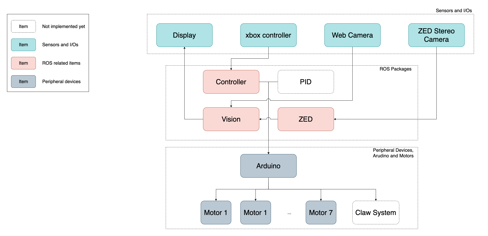

# 🤖 mate-rov

Mono-repository for CURC's [MATE ROV](https://www.marinetech.org/rov-competition-2/) code.

## Project Structure
```
.
+-- arduino
|   +-- rov_motor_control
|   +-- rov_motor_control_working
+-- ros
|   +-- build
|   +-- devel
|   +-- src
+-- README.md
+-- LICENSE.md
```

## The Software Diagram



This repository contains all of the code for the ROS packages and Arduino controllers. 

## How to Install Locally

PLEASE NOTE: The project only supports Linux machines. Unfortunately you can't run the code on a Mac or Windows without a virtual desktop. 

To install and run the code locally, you need to first install Robot Operating System (ROS). There are multiple ROS distributions, we recommend you using ROS Melodic Morenia. Here is a very brief guide. For more details please refer to [ROS's official website](http://wiki.ros.org/melodic/Installation). 

1. Set up your sources.list: `sudo sh -c 'echo "deb http://packages.ros.org/ros/ubuntu $(lsb_release -sc) main" > /etc/apt/sources.list.d/ros-latest.list'`
2. Set up your keys: `sudo apt-key adv --keyserver 'hkp://keyserver.ubuntu.com:80' --recv-key C1CF6E31E6BADE8868B172B4F42ED6FBAB17C654`
3. `sudo apt update`
4. Install: `sudo apt install ros-melodic-desktop-full`
5. Initialize rosdep: `sudo rosdep init` and `rosdep update`

Now, you are ready to clone the repo and run the code. 

1. `git clone`

## Running/Testing
To compile and run the project:

1. `cd ros`
2. `catkin_make`
3.	`source devel/setup.bash`
4. 	`roslaunch driver rov.launch`


## Contributing
To contribute code to this repository, you must:

1. Ensure your current code does not affect major changes from the most recent master branch. To do this, constantly run `git pull` every time you write new code locally.
2. [Submit a pull request](https://github.com/columbia-university-robotics/mate-rov/pulls) to commit the changes to the repository. You'll require **one approval** from another developer before the code can be merged to the `master` branch.
3. Once approved, your remote branch will be committed to `master`.

## Naming Commits

### Do
Provide short, accurate descriptions of your code changes.

For example:

- `Fixed backwards/forwards mixup bug`
- `Changed tracking tolerance to 0.9`

### Don't
Provide long or cryptic commit messages.

For example:

- `Created a new technique that tracks the presence of baby dolphins in the pool and propels the robot to swim directly to these dolphins`
- `Updated driver code`

## Naming Remote Branches

### `feat-FEATURE_NAME`
Name your remote branch this if you are working on an entirely new feature for the project.

### `fix-FEATURE_NAME-##`
Name your remote branch this if you are fixing an already-existing feature. Feel free to add or ommit numbers at the end of the name to discern your branch from others.

## `refactor-FEATURE_NAME`
Name your remote branch this if you are refactoring something in an already-existing feature, such as changing a variable name. The above applies here.

### `test-FEATURE_NAME`
Name your remote branch this if you are testing an already-existing feature. The above applies here too.

## License

This project is licensed under the MIT License - see the [LICENSE.md](LICENSE.md) file for details.

## Contact

For any inquiries, questions, comments, or concerns, please contact Neil at neil.nie@columbia.edu. 

For CURC club members and those who would like to join CURC, please reach out and join the Slack channel. 